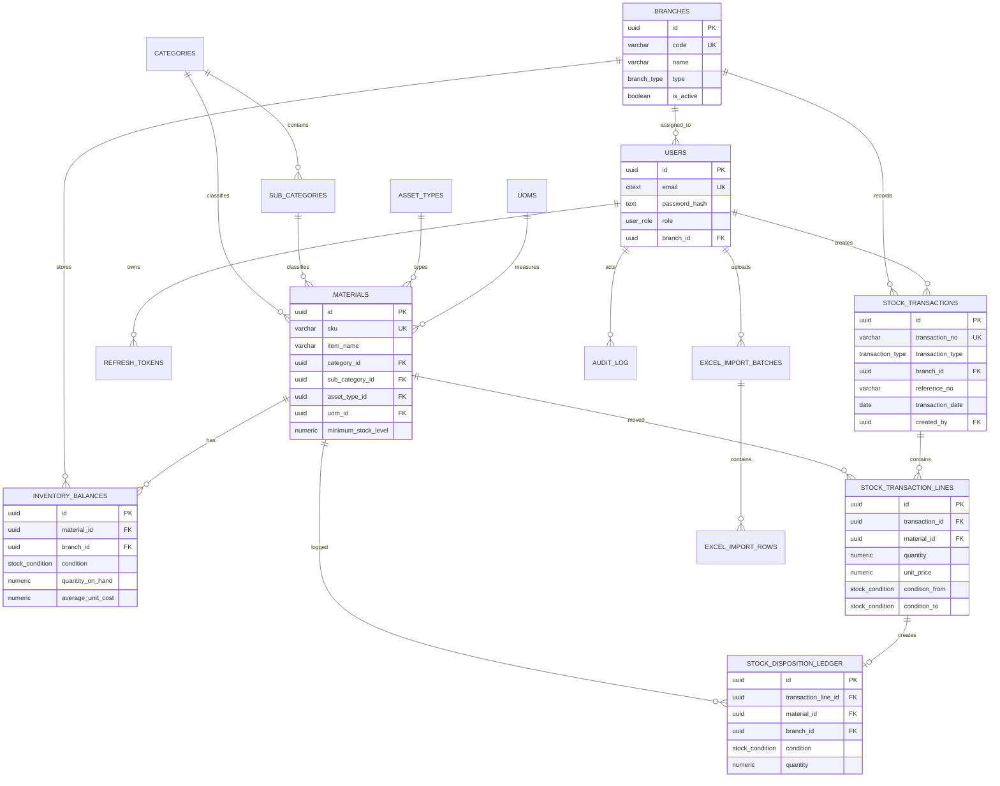

# Inventory ERD

## Core Relationship Rules

- `inventory_balances` has exactly one row per `material_id`, `branch_id`, and `condition`.
- Normal usable stock is `condition = GOOD`.
- Non-good stock is isolated under `REJECTED`, `DAMAGED`, `BUYBACK`, or `SCRAP`.
- Inward transactions increment `condition_to`.
- Outward transactions decrement `condition_from = GOOD`.
- Disposition transactions decrement `condition_from` and increment `condition_to`.
- Transaction lines are immutable; corrections must be reversal or adjustment transactions.
